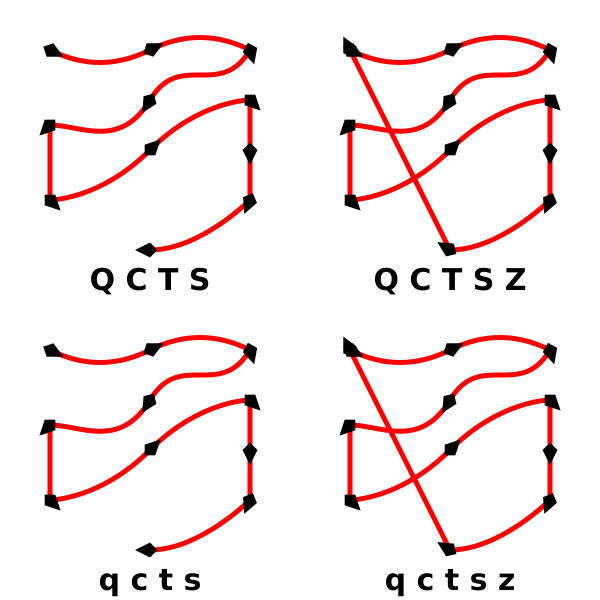
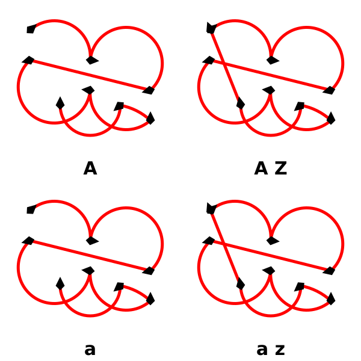

Testcases for changes to CairoSVG's mechanism for path angles and markers.

Column explanation:
* **[Inkscape](https://inkscape.org/)**'s PNG export and **Firefox** Screenshots as a reference
* **Kozea**: current version of the [original CairoSVG library](https://github.com/Kozea/CairoSVG)
* **AgC/main**: this repo's [`main`](https://github.com/SilverCardioid/CairoSVG/) branch, my own work-in-progress fork of CairoSVG (not included below)
* **AgC/master**: the [`master`](https://github.com/SilverCardioid/CairoSVG/tree/master) branch, used for proposing minor changes to Kozea/CairoSVG and otherwise kept in sync with it

The rightmost images are visualisations of the `node.vertices` array, which is internally used for the marker positions and angles. For each vertex, the calculated direction of the outgoing path segment is green, and that of the incoming segment (pointing away from it) is purple. Grey means the two overlap.

## Lines
|     |     |     |
| :-: | :-: | :-: |
|  **Inkscape** |  **Kozea** |  **Kozea (vertices)** |
|  **Firefox**|  **AgC/master**  |  **AgC/master (vertices)** |

## Beziers
This test file includes a few degenerate curves, of which some or all control points coincide with vertices. In the current Kozea version, they result in a mathematically undefined `math.atan2(0,0)` (although that function returns an angle of zero degrees, hence all the arrows to the right in Kozea/vertices). The newer version fixes this by noting that the angles correspond to those of the lower-degree Bezier created by removing those control points. The extreme case, a zero-length segment (including those made with `L` or `A`), does not give correct angles yet.
|     |     |     |
| :-: | :-: | :-: |
|  **Inkscape** |  **Kozea** |  **Kozea (vertices)** |
|  **Firefox**|  **AgC/master**  |  **AgC/master (vertices)** |

## Circular arcs
In the two arc test files, the central segments of each sub-path are arcs with zero radius, which according to [the SVG specification](https://www.w3.org/Graphics/SVG/1.1/implnote.html#ArcOutOfRangeParameters) should be treated as a straight line. Inkscape [fails to render this](arcs-ink.png) (apparently painting a large solid black or white rectangle instead of the path), so its images were made with versions of the files that use an `L` instead.
|     |     |     |
| :-: | :-: | :-: |
|  **Inkscape** |  **Kozea** |  **Kozea (vertices)** |
|  **Firefox**|  **AgC/master**  |  **AgC/master (vertices)** |

## Elliptic arcs
|     |     |     |
| :-: | :-: | :-: |
|  **Inkscape** |  **Kozea** |  **Kozea (vertices)** |
|  **Firefox**|  **AgC/master**  |  **AgC/master (vertices)** |

## Moveto, closepath and marker types
|     |     |     |
| :-: | :-: | :-: |
|  **Inkscape** |  **Kozea** |  **Kozea (vertices)** |
|  **Firefox**|  **AgC/master**  |  **AgC/master (vertices)** |

## Closing vertex angles & marker overlap
A note on a discrepancy between Inkscape and CairoSVG in the previous tests: on the initial vertex of closed sub-paths, Inkscape doesn't average the angles of the adjoining segments as [the specification](https://www.w3.org/Graphics/SVG/1.1/painting.html#Markers) stipulates (which AgC/master follows, as do Firefox and the few other browsers I've tried), but instead places two markers in the direction of the first and last segments, as if the path had been "manually closed" with an `L`.

Contrary to what I originally assumed, Firefox actually also draws two overlapping markers, although obviously only one will be visible if their shape and orientation are the same. This behaviour is in line with the specification ("for a 'path' element which ends with a closed sub-path, (...) if 'marker-end' does not equal none, then it is possible that two markers will be rendered on the given vertex."), and is made clear in the following comparison, in which the three marker types (start, mid and end) use differently sized circles.
|     |     |
| :-: | :-: |
|  **Inkscape** |  **Kozea** |
|  **Firefox** |  **AgC/master** |

The seemingly missing markers in the top left and bottom right of the Inkscape image are due to an inconsistency in the drawing order. Whereas Firefox and AgC/master draw overlapping markers in order of appearance in the path (i.e., start below mid, mid below end), Inkscape places the purple start marker on top of the smaller green mid marker (and likewise for mid and end). The specification isn't clear on this as far as I can see, although the former behaviour seems more sensible.

## Marker size & gradients
[I removed](https://github.com/SilverCardioid/CairoSVG/commit/0835fc88780de1272eeb9181a02986d4289146cc) a section of code that scales markers based on their bounding box after noticing the testcase in the previous section was mistakenly drawn with equally sized markers. This part was [added in 2016](https://github.com/Kozea/CairoSVG/pull/89) in a series of edits relating to gradients, though what exact problem it was intended to fix isn't clear to me. This testcase renders the gradient on the markers correctly.
|     |     |
| :-: | :-: |
|  **Inkscape** |  **Kozea** |
|  **Firefox** |  **AgC/master** |
